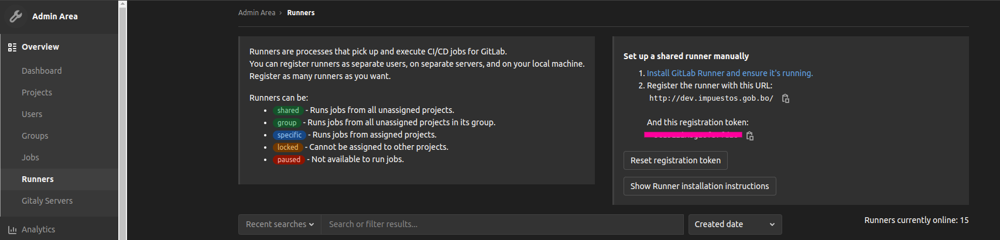

# Instalacion de gitlab-runner sobre kubernetes con OperatorHub.io
<div style='text-align:right; font-size:12px; font-style:italic;'>13-10-2022</div>

- Urls de referencia
   >  https://operatorhub.io/operator/gitlab-runner-operator
   
   > https://docs.gitlab.com/runner/install/operator.html#install-on-kubernetes

##### 1. Instalaicon de certificados
Posicionandonos en el master del cluster es necesario realizar la instalacion de los certificados como requisito segun OperatorHub.io

```shell
$ kubectl apply -f https://github.com/jetstack/cert-manager/releases/download/v1.7.1/cert-manager.yaml
```
##### 2. Instalar OLM
Operator Lifecycle Manager, es una herramienta que ayuda a la gestion de operadores ejecutandose en el cluster
```shell
$ curl -sL https://github.com/operator-framework/operator-lifecycle-manager/releases/download/v0.22.0/install.sh | bash -s v0.22.0
```

##### 3. Instalar el operador
Procederemos a instalar el operador gitlab-runner
```shell
$ kubectl create -f https://operatorhub.io/install/gitlab-runner-operator.yaml
```
Este operador se instalara en el namespace **operadores** del cluster

Despues de instalar el operador sera posible verlo con el siguiente comando
```shell
$ kubectl get csv -n operators

NAME                             DISPLAY         VERSION   REPLACES                        PHASE
gitlab-runner-operator.v1.10.0   GitLab Runner   1.10.0    gitlab-runner-operator.v1.9.0   Succeeded
```

##### 4. Crear archivo gitlab-runner-secret.yaml
```yaml
apiVersion: v1
kind: Secret
metadata:  
  name: gitlab-runner-secret  
  namespace: gitlab
type: Opaque
stringData:
  runner-registration-token: <token obtenido de gitlab>
```

El token solicitado podemos obtenerlo de gitlab, este token sera el utilizado para el runner compartido por todos los proyectos dentro de gitlab

<kbd></kbd>

##### 5. Crear el archivo gitlab-runner.yaml
```yaml
apiVersion: apps.gitlab.com/v1beta2
kind: Runner
metadata:
  name: gitlab-runner
  namespace: gitlab
spec:
  gitlabUrl: http://dev.impuestos.gob.bo/
  buildImage: alpine
  token: gitlab-runner-secret
```

El valor de gitlabUrl puede variar acorde se defina la URL de nuestro repositorio gitlab, el valor token hace referencia al secreto anteriormente creado

##### 6. Aplicar los archivos yamls creados en el cluster de kubernetes

Como se puede observar en los archivos yamls se muestra un namespace con el valor **gitlab**, podemos instalar el runner en culaquier namespace deseado en este caso usamos el namespace **gitlab**, por lo que crearemos el namespace dentro del cluster antes de ejecutar los archivos.
```shell
$ kubectl create namespace gitlab
namespace/gitlab created
```

```shell
$ kubectl apply -f gitlab-runner-secret.yaml
secret/gitlab-runner-secret created
$ kubectl apply -f gitlab-runner.yaml
runner.apps.gitlab.com/gitlab-runner created
```
Una vez se haya ejecutado los yamls se podra observar el pod del runner creado
```shell
$ kubectl get pods -n gitlab
NAME                                    READY   STATUS    RESTARTS   AGE
gitlab-runner-runner-7594bb6dc7-w2rd9   1/1     Running   0          5m
```
Una vez obtengamos este resultado podremos ejecutar los pipelines dentro de nuestros proyectos gitlab, con el runner compartido.
